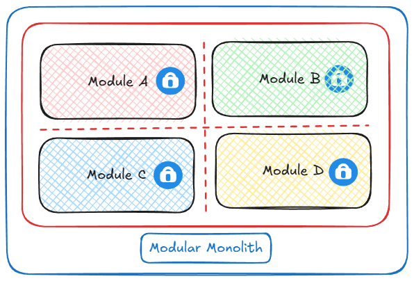
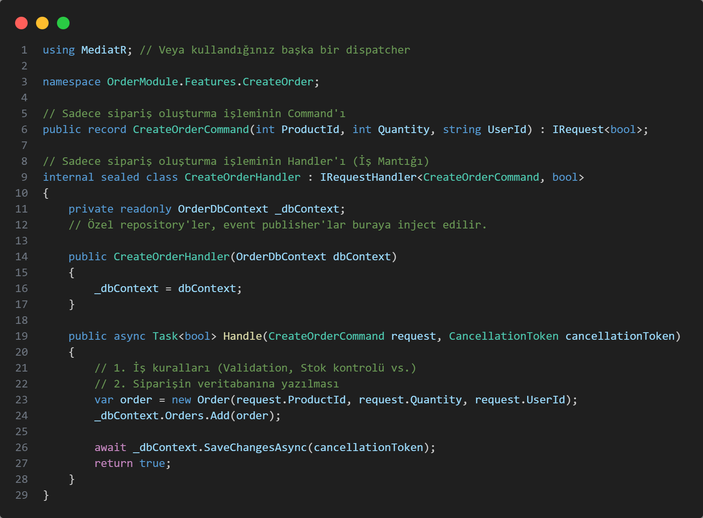
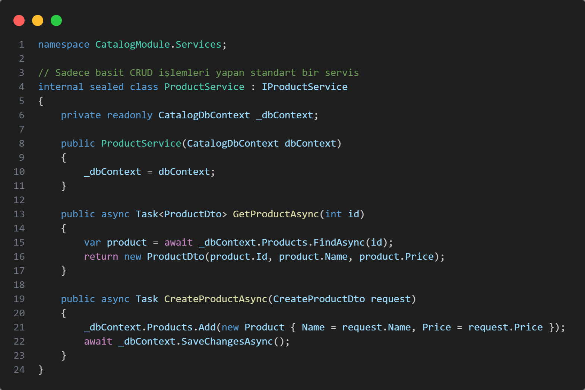
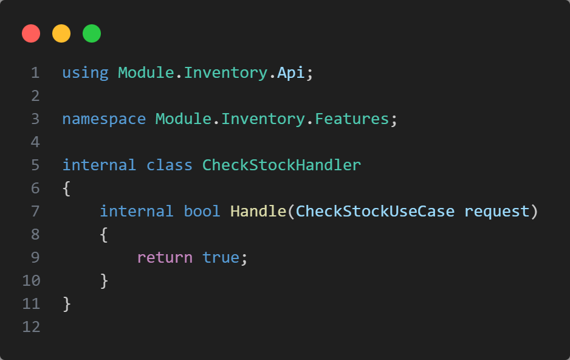
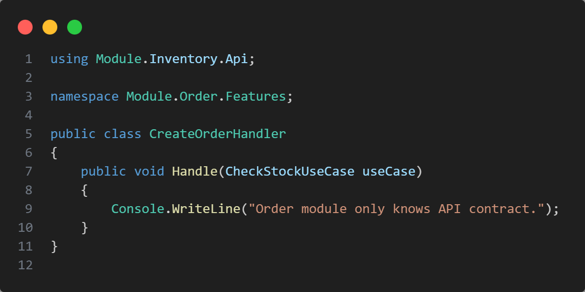
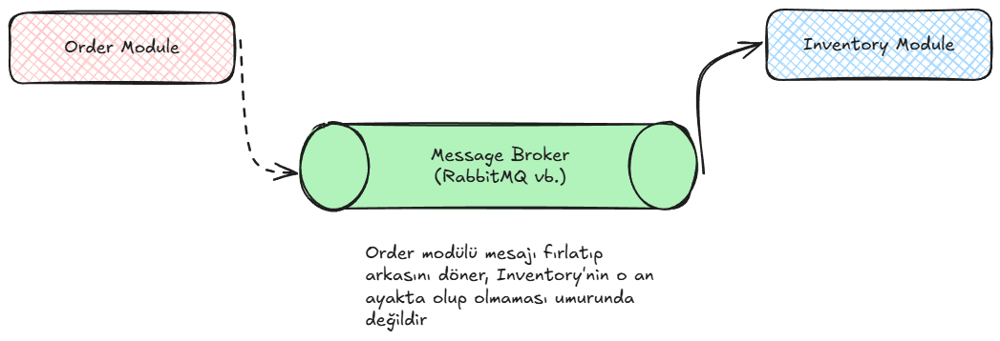
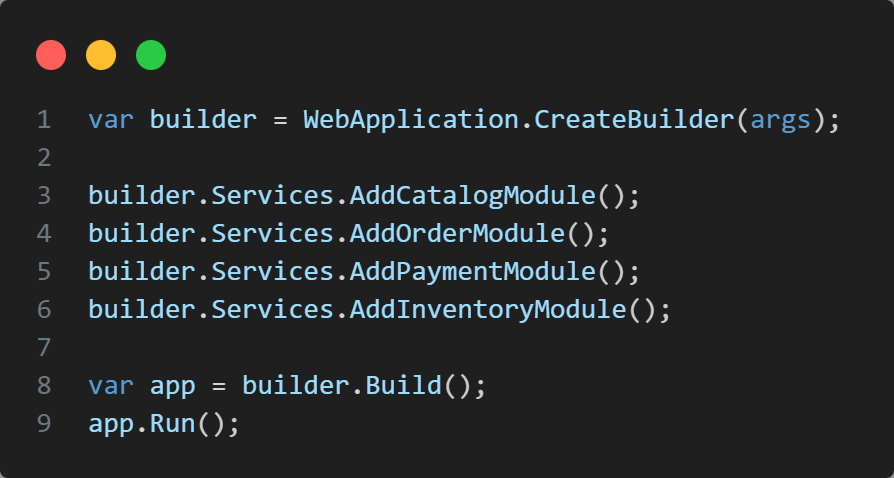
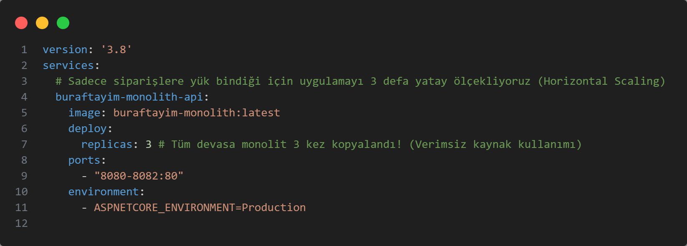

# Modular Monolith Architecture

## Giriş ve Motivasyon

Yazılım dünyasında genellikle monolith yapılarla başlayan süreçler, katmanlı mimari ve ardından Clean Architecture ile devam eder. Dış bağımlılıkların artması ve farklı veri kaynağı ihtiyaçları gibi sebeplerle mikroservis mimarisine geçiş popüler bir seçenek olsa da, bu geçişin getirdiği karmaşıklık çoğu zaman projenin erken aşamalarında yönetilemez hale gelir.

### Monolith Mimarinin Zorlukları

Geleneksel monolith yapılar, uygulama büyüdükçe şu temel sorunları beraberinde getirir:

*   **Bakım Zorluğu:** Kod tabanı şiştikçe dosyalar arasında yönetim ve bakım sancılı bir hal alır.
*   **Öğrenme Eğrisi:** Yeni ekip üyelerinin projeyi anlayıp katkı sağlamaya başlaması uzun zaman alır.
*   **Ölçeklendirme Sorunları:** Uygulama yatay olarak bölümlere ayrılamadığından, en küçük parça için bile tüm sistemin ölçeklenmesi gerekir, bu da maliyeti artırır.
*   **Hata Yayılımı:** Uygulamanın herhangi bir yerindeki hata tüm sistemin kesintiye uğramasına neden olabilir.

## Çözüm: Modular Monolith

Modular Monolith Architecture, monolith mimarinin basitliğini mikroservislerin esnekliği ve modülerliği ile birleştiren bir yaklaşımdır. Sistemi iş alanlarına göre net ve katı sınırlarla (Bounded Context) bölerek tasarlamayı hedefler.

Kod tabanı rastgele değil, bilinçli olarak modüllere ayrılmıştır. Her modül kendi iş kurallarını, akışını ve iç yapısını yönetir. Modüller birbirlerinin iç detaylarına erişemez; sadece belirli kontratlar üzerinden iletişim kurarlar.



## Mikroservislerle Karşılaştırma ve Riskler

Doğrudan mikroservis mimarisi ile başlamak, projenin erken safhalarında ciddi riskler barındırır. Google - "Towards Modern Development of Cloud Applications" makalesinde de belirtildiği üzere, bu riskler şunlardır:

*   **Performans:** Servisler arası iletişimdeki serialization ve ağ gecikmeleri performans kaybı yaratır.
*   **Doğruluk:** Dağıtık sistemlerde anlık durumun doğruluğundan emin olmak zordur.
*   **Yönetim:** Farklı yayın planları olan çok sayıda servisi yönetmek operasyonel bir yüktür.
*   **Dondurulmuş API'ler:** Bir API yayına alındıktan sonra diğer servisleri bozmadan değişiklik yapmak zordur.
*   **Geliştirme Hızı:** Bir servisteki değişikliğin zincirleme etkileri geliştirme hızını yavaşlatabilir.

Martin Fowler'ın da belirttiği gibi, projelere monolith ile başlamak daha güvenlidir; ancak klasik bir monolit yerine modüler bir monolit tercih etmek, ileride ihtiyaç duyulduğunda mikroservislere geçişi çok daha zahmetsiz hale getirir.

## Temel Kavramlar

*   **Bounded Context:** Bir iş alanının (örneğin "Sipariş") kendi mantığının geçerli olduğu, dış dünyadan izole edilmiş sınırdır.
*   **Loosely Coupled (Gevşek Bağlılık):** Modüllerin birbirinin iç yapısını bilmeden çalışabilmesidir.
*   **Separation of Concerns (Sorumlulukların Ayrılığı):** Her modülün sadece kendi amacına odaklanmasıdır.
*   **Contract (Kontrat):** Modüllerin birbiriyle iletişim kurmasını sağlayan Interface veya DTO/Event gibi kurallar bütünüdür.

## Mimari Kararlar ve Uygulama Prensipleri

### 1. Host (Program.cs) ve IoC Yönetimi [(Project Structure)](ModularMonolithProject)

Tüm modülleri ana `Program.cs` dosyasına yığmak yerine, her modülün kendi bağımlılıklarını yönettiği bir Composition Root yapısı kullanılır.

*   Her modülün kendi `IServiceCollection` extension metodu olmalıdır.
*   Ana uygulama sadece modülleri tetikleyen bir orkestra şefi görevini üstlenir.

 [InventoryModuleInstaller.cs](ModularMonolithProject/src/Modules/InventoryModule/InventoryModuleInstaller.cs) (Inventory Modülü İçinde):
```csharp
using Microsoft.Extensions.DependencyInjection;
// Sadece bu modülün içindeki (Internal) sınıfları bilir

namespace InventoryModule.Core;

public static class InventoryModuleInstaller
{
    public static IServiceCollection AddInventoryModule(this IServiceCollection services, string connectionString)
    {
        // 1. Modülün kendi veritabanı kaydı
        services.AddDbContext<InventoryDbContext>(options => options.UseSqlServer(connectionString));

        // 2. Modülün kendi servisleri (Dışarıya sadece Interface ile açılır)
        services.AddScoped<IInventoryService, InventoryService>();

        return services;
    }
}
```

 [Program.cs](ModularMonolithProject/src/Host/Program.cs) (Host Projesi İçinde):
```csharp
using InventoryModule.Core;
using OrderModule.Core;

var builder = WebApplication.CreateBuilder(args);
var connectionString = builder.Configuration.GetConnectionString("DefaultConnection");

// Modüllerin Kendi IoC'lerini (Composition Root) Tetikliyoruz
builder.Services.AddInventoryModule(connectionString);
builder.Services.AddOrderModule(connectionString);

var app = builder.Build();

app.Run();
```

### 2. Esnek İç Mimari (Context-Specific Architecture)

Sistemdeki her modül aynı karmaşıklıkta olmayabilir. Bu nedenle modül bazlı farklı yaklaşımlar benimsenebilir:

*   **Basit CRUD Modülleri:** Daha az karmaşık işler için doğrudan Service/Repository pattern kullanılabilir.
*   **Karmaşık İş Modülleri:** Yoğun iş kuralı içeren alanlarda Vertical Slice Architecture, CQRS veya Domain Driven Design (DDD) uygulanabilir.



### 3. Katı İzolasyon ve Vault (Kasa) Yaklaşımı

Modüller arası sınırları korumak disiplin kadar teknik engellerle de sağlanmalıdır.

*   **Kural:** Modülün iç mantığı (Domain, Data Access) internal tutulmalı, sadece kontratlar public olmalıdır.
*   **Vault:** Roslyn Analyzer'lar kullanılarak bir modülün diğerinin iç detaylarına erişmesi derleme anında (Build-time) engellenmelidir.



## Modüller Arası İletişim Modelleri

### Senkron İletişim (Synchronous)

Modüllerin birbirini bellek içi (in-memory) metot çağrıları üzerinden çağırdığı modeldir.

*   **Avantaj:** Muazzam hız ve düşük gecikme.
*   **Dezavantaj:** Sıkı bağlılık (Bir modül çökerse diğeri de etkilenebilir).


### Asenkron İletişim (Asynchronous)

Message Broker (RabbitMQ vb.) üzerinden mesaj fırlatarak (Publish/Subscribe) kurulan iletişimdir.

*   **Avantaj:** Tam gevşek bağlılık ve yüksek erişilebilirlik.
*   **Dezavantaj:** Sistem karmaşıklığında ve operasyonel maliyette artış.



## Ölçeklenebilirlik Çizgisi ve Sınırlar

Modular Monolith yatay ölçeklendirmede (Horizontal Scaling) bir bütün olarak hareket eder. Eğer sadece 'Sipariş' modülüne yük biniyorsa, tüm uygulamayı (diğer tüm modüllerle birlikte) çoğaltmak zorunda kalırsınız.

Bu, bir noktada kaynak israfına neden olabilir. Eğer ileride modül bazlı bağımsız ölçekleme kesin bir ihtiyaç olacaksa, o noktada modül mikroservise dönüştürülmelidir.




## Özet: Avantajlar ve Zorluklar

### Avantajlar
*   **Basit Dağıtım:** Tek parça uygulama olarak kolayca deploy edilir.
*   **Yüksek Performans:** Ağ gecikmesi olmadan hızlı bellek içi iletişim sağlar.
*   **İşlem Yönetimi:** Karmaşık distributed transaction yönetiminden kurtarır.
*   **Mikroservis Hazırlığı:** Gelecekteki ayrıştırmalar için net bir zemin hazırlar.

### Zorluklar
*   **Ölçekleme İsrafı:** Modül bazlı değil, bütün bazlı ölçekleme yapılır.
*   **Teknoloji Bağımlılığı:** Tüm modüller genellikle aynı teknoloji yığınına mahkumdur.
*   **Tek Hata Noktası:** Bir modüldeki kritik hata tüm süreci durdurabilir.


## Kaynakçalar

*   https://serhatleventyavas.dev/monolitik-mimarinin-gucu-ve-sinirlari-mikroservislere-gecisin-ilk-adimi
*   https://medium.com/@husain.ammar/modular-monoliths-explained-structure-strategy-and-scalability-ba94b103b345
*   https://www.ahmetkucukoglu.com/modular-monolith-nedir
*   https://www.milanjovanovic.tech/blog/modular-monolith-communication-patterns
*   https://www.milanjovanovic.tech/blog/what-is-a-modular-monolith
*   https://www.gencayyildiz.com/blog/moduler-monolitik-mimari-modular-monolith-architecture-nedir-derinlemesine-inceleyelim/
*   https://ebrududak.medium.com/mod%C3%BCler-monolit-mimariye-genel-bir-bak%C4%B1%C5%9F-1ae090653f98
*   https://github.com/Wsm2110/Faster.Modulith
*   https://github.com/dotnet-architecture/eShopOnContainers/tree/dev
*   **Towards Modern Development of Cloud Applications:** https://dl.acm.org/doi/pdf/10.1145/3593856.3595909
