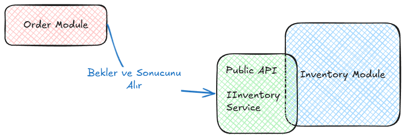

# Modular Monolith Architecture

## İçindekiler

1. [Giriş ve Motivasyon](#giriş-ve-motivasyon)
    - [Monolith Mimarinin Zorlukları](#monolith-mimarinin-zorlukları)
2. [Çözüm: Modular Monolith](#çözüm-modular-monolith)
3. [Mikroservislerle Karşılaştırma ve Riskler](#mikroservislerle-karşılaştırma-ve-riskler)
4. [Temel Kavramlar](#temel-kavramlar)
5. [Mimari Katmanlar ve Proje Yapısı](#mimari-katmanlar-ve-proje-yapısı)
    - [1. Host (Program.cs) ve IoC Yönetimi](#1-host-programcs-ve-ioc-yönetimi)
    - [2. Esnek İç Mimari (Context-Specific Architecture)](#2-esnek-iç-mimari-context-specific-architecture)
    - [3. Ölçeklenebilirlik Çizgisi ve Sınırlar](#3-ölçeklenebilirlik-çizgisi-ve-sınırlar)
6. [Modüller Arası İletişim ve İzolasyon Seviyeleri](#modüller-arası-iletişim-ve-izolasyon-seviyeleri)
    - [Level 1: Senkron İletişim (Synchronous)](#level-1-senkron-iletişim-synchronous)
    - [Level 2: Asenkron İletişim (Asynchronous)](#level-2-asenkron-iletişim-asynchronous)
    - [Level 3: Tam İzolasyon ve Vault (Kasa) Yaklaşımı](#level-3-tam-izolasyon-ve-vault-kasa-yaklaşımı)
7. [Özet: Avantajlar ve Zorluklar](#özet-avantajlar-ve-zorluklar)
8. [Kaynakçalar](#kaynakçalar)

---


## Giriş ve Motivasyon

Yazılım dünyasında genellikle monolith yapılarla başlayan süreçler, katmanlı mimari ve ardından Clean Architecture ile devam eder. Dış bağımlılıkların artması ve farklı veri kaynağı ihtiyaçları gibi sebeplerle mikroservis mimarisine geçiş popüler bir seçenek olsa da, bu geçişin getirdiği karmaşıklık çoğu zaman projenin erken aşamalarında yönetilemez hale gelir.

### Monolith Mimarinin Zorlukları

Geleneksel monolith yapılar, uygulama büyüdükçe şu temel sorunları beraberinde getirir:

*   **Bakım Zorluğu:** Kod tabanı şiştikçe dosyalar arasında yönetim ve bakım sancılı bir hal alır.
*   **Öğrenme Eğrisi:** Yeni ekip üyelerinin projeyi anlayıp katkı sağlamaya başlaması uzun zaman alır.
*   **Ölçeklendirme Sorunları:** Uygulama yatay olarak bölümlere ayrılamadığından, en küçük parça için bile tüm sistemin ölçeklenmesi gerekir, bu da maliyeti artırır.
*   **Hata Yayılımı:** Uygulamanın herhangi bir yerindeki hata tüm sistemin kesintiye uğramasına neden olabilir.

## Çözüm: Modular Monolith

Modular Monolith Architecture, monolith mimarinin basitliğini mikroservislerin esnekliği ve modülerliği ile birleştiren bir yaklaşımdır. Sistemi iş alanlarına göre net ve katı sınırlarla (Bounded Context) bölerek tasarlamayı hedefler.

Kod tabanı rastgele değil, bilinçli olarak modüllere ayrılmıştır. Her modül kendi iş kurallarını, akışını ve iç yapısını yönetir. Modüller birbirlerinin iç detaylarına erişemez; sadece belirli kontratlar üzerinden iletişim kurarlar.


## Mikroservislerle Karşılaştırma ve Riskler

Doğrudan mikroservis mimarisi ile başlamak, projenin erken safhalarında ciddi riskler barındırır. Google - "Towards Modern Development of Cloud Applications" makalesinde de belirtildiği üzere, bu riskler şunlardır:

*   **Performans:** Servisler arası iletişimdeki serialization ve ağ gecikmeleri performans kaybı yaratır.
*   **Doğruluk:** Dağıtık sistemlerde anlık durumun doğruluğundan emin olmak zordur.
*   **Yönetim:** Farklı yayın planları olan çok sayıda servisi yönetmek operasyonel bir yüktür.
*   **Dondurulmuş API'ler:** Bir API yayına alındıktan sonra diğer servisleri bozmadan değişiklik yapmak zordur.
*   **Geliştirme Hızı:** Bir servisteki değişikliğin zincirleme etkileri geliştirme hızını yavaşlatabilir.

Martin Fowler'ın da belirttiği gibi, projelere monolith ile başlamak daha güvenlidir; ancak klasik bir monolit yerine modüler bir monolit tercih etmek, ileride ihtiyaç duyulduğunda mikroservislere geçişi çok daha zahmetsiz hale getirir.

## Temel Kavramlar

*   **Bounded Context:** Bir iş alanının (örneğin "Sipariş") kendi mantığının geçerli olduğu, dış dünyadan izole edilmiş sınırdır.
*   **Loosely Coupled (Gevşek Bağlılık):** Modüllerin birbirinin iç yapısını bilmeden çalışabilmesidir.
*   **Separation of Concerns (Sorumlulukların Ayrılığı):** Her modülün sadece kendi amacına odaklanmasıdır.
*   **Contract (Kontrat):** Modüllerin birbiriyle iletişim kurmasını sağlayan Interface veya DTO/Event gibi kurallar bütünüdür.

## Mimari Katmanlar ve Proje Yapısı

### 1. Host (Program.cs) ve IoC Yönetimi

Tüm modülleri ana `Program.cs` dosyasına yığmak yerine, her modülün kendi bağımlılıklarını yönettiği bir **Composition Root** yapısı kullanılır. Bu sayede ana proje sadece modülleri ayağa kaldıran bir tetikleyici görevini üstlenir.

*   **Host:** Uygulamanın giriş noktasıdır. Sadece hangi modüllerin kullanılacağını bilir.
*   **Module Installer:** Her modülün içindeki `IServiceCollection` extension metodudur.

 [InventoryModuleInstaller.cs](ModularMonolithProject/src/Modules/InventoryModule/InventoryModuleInstaller.cs) (Inventory Modülü):
```csharp
public static class InventoryModuleInstaller
{
    public static IServiceCollection AddInventoryModule(this IServiceCollection services, string connectionString)
    {
        services.AddDbContext<InventoryDbContext>(options => options.UseSqlServer(connectionString));
        services.AddScoped<IInventoryService, InventoryService>();
        return services;
    }
}
```

 [Program.cs](ModularMonolithProject/src/Host/Program.cs) (Host Projesi):
```csharp
// Modüllerin Kendi IoC'lerini (Composition Root) Tetikliyoruz
builder.Services.AddInventoryModule(connectionString);
builder.Services.AddOrderModule(connectionString);
```

### 2. Esnek İç Mimari (Context-Specific Architecture)

Sistemdeki her modül aynı karmaşıklıkta olmayabilir. Modülün iş yüküne göre farklı iç mimariler benimsenebilir:

*   **Basit CRUD Modülleri:** Daha az karmaşık işler için doğrudan Service/Repository pattern kullanılabilir.
*   **Vertical Slice Architecture:** Yoğun iş kuralı içeren alanlarda Feature bazlı (Command/Query) bir yapı uygulanabilir.

[ProductService.cs](Modules/CatalogModule/Services/ProductService.cs) (Basit CRUD Örneği):
```csharp
internal sealed class ProductService : IProductService { /* Standart CRUD metotları */ }
```

[CreateOrderHandler.cs](Modules/OrderModule/Features/CreateOrder/CreateOrderHandler.cs) (Vertical Slice/CQRS Örneği):
```csharp
internal sealed class CreateOrderHandler : IRequestHandler<CreateOrderCommand, bool> { /* İş mantığı buradadır */ }
```

### 3. Ölçeklenebilirlik Çizgisi ve Sınırlar

Modular Monolith yatay ölçeklendirmede bir bütün olarak hareket eder. Ancak ileride modül bazlı bağımsız ölçekleme kesin bir ihtiyaç olursa, o noktada modül mikroservise dönüştürülmelidir.

 

## Modüller Arası İletişim ve İzolasyon Seviyeleri

### Level 1: Senkron İletişim (Synchronous)

Modüllerin birbirini bellek içi (in-memory) interface çağrıları üzerinden çağırdığı modeldir. Hızlıdır ancak sıkı bağlılık (strong coupling) yaratır.



*   [IInventoryService.cs](MyModularMonolith/01-Synchronous/Shared/Contracts/IInventoryService.cs) (Kontrat)
*   [InventoryService.cs](MyModularMonolith/01-Synchronous/Modules/InventoryModule/Services/InventoryService.cs) (Uygulama)

### Level 2: Asenkron İletişim (Asynchronous)

Message Broker (RabbitMQ vb.) üzerinden mesaj fırlatarak (Publish/Subscribe) kurulan iletişimdir. Tam gevşek bağlılık (loose coupling) sağlar.


*   [OrderCreatedEvent.cs](MyModularMonolith/02-Asynchronous/Shared/IntegrationEvents/OrderCreatedEvent.cs) (Olay)
*   [OrderCreatedEventHandler.cs](MyModularMonolith/02-Asynchronous/Modules/InventoryModule/EventHandlers/OrderCreatedEventHandler.cs) (Tüketici)

### Level 3: Tam İzolasyon ve Vault (Kasa) Yaklaşımı

Modüller arası sınırları sadece disiplinle değil, teknik engellerle de (Internal access modifiers) koruma modelidir. Modülün iç mantığı tamamen gizlidir, sadece API katmanı dışarıya açılır.

*   [CheckStockUseCase.cs](MyModularMonolith/03-Vault/src/Modules/Module.Inventory.Api/CheckStockUseCase.cs) (Kontrat)
*   [CheckStockHandler.cs](MyModularMonolith/03-Vault/src/Modules/Module.Inventory/Features/CheckStockHandler.cs) (Gizli İç Mantık)
## Özet: Avantajlar ve Zorluklar

### Avantajlar
*   **Basit Dağıtım:** Tek parça uygulama olarak kolayca deploy edilir.
*   **Yüksek Performans:** Ağ gecikmesi olmadan hızlı bellek içi iletişim sağlar.
*   **İşlem Yönetimi:** Karmaşık distributed transaction yönetiminden kurtarır.
*   **Mikroservis Hazırlığı:** Gelecekteki ayrıştırmalar için net bir zemin hazırlar.

### Zorluklar
*   **Ölçekleme İsrafı:** Modül bazlı değil, bütün bazlı ölçekleme yapılır.
*   **Teknoloji Bağımlılığı:** Tüm modüller genellikle aynı teknoloji yığınına mahkumdur.
*   **Tek Hata Noktası:** Bir modüldeki kritik hata tüm süreci durdurabilir.


## Kaynakçalar

*   https://serhatleventyavas.dev/monolitik-mimarinin-gucu-ve-sinirlari-mikroservislere-gecisin-ilk-adimi
*   https://medium.com/@husain.ammar/modular-monoliths-explained-structure-strategy-and-scalability-ba94b103b345
*   https://www.ahmetkucukoglu.com/modular-monolith-nedir
*   https://www.milanjovanovic.tech/blog/modular-monolith-communication-patterns
*   https://www.milanjovanovic.tech/blog/what-is-a-modular-monolith
*   https://www.gencayyildiz.com/blog/moduler-monolitik-mimari-modular-monolith-architecture-nedir-derinlemesine-inceleyelim/
*   https://ebrududak.medium.com/mod%C3%BCler-monolit-mimariye-genel-bir-bak%C4%B1%C5%9F-1ae090653f98
*   https://github.com/Wsm2110/Faster.Modulith
*   https://github.com/dotnet-architecture/eShopOnContainers/tree/dev
*   **Towards Modern Development of Cloud Applications:** https://dl.acm.org/doi/pdf/10.1145/3593856.3595909
